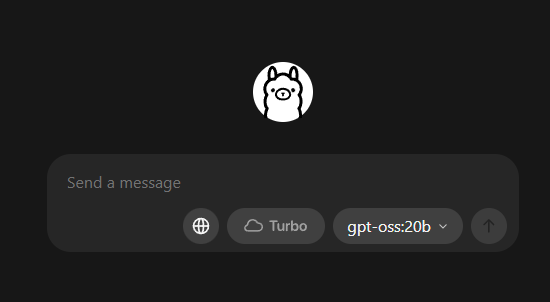

# INSTALLATION
**Pouravoir votre Notion Toker et Database ID : [Voir la documentation complète](Tuto\Tutoriel_Récupérer_votre_Integration_Token_et_Data_ID.md)**
> **Prérequis :** 
>
>- **installation de Ollama (gpt-oss:20b), lancez le :** [Download Ollama on Windows](https://ollama.com/download)
>    
>    
    

### **Commencez par extraire *AutoResumeNotion.zip* :** 
---

### **Lancez ensuite *installer.bat* :** 
---

### **Suivez l’installation jusque voir *Succès* :** 
---

### **Pour finir allez sur *Notion*, puis créez votre bouton de résumé** : 
---
- Ajoutez l’action Open, puis ajoutez le lien
    
    > [https://karletudiant.github.io/ResumeNotionSite/](https://karletudiant.github.io/ResumeNotionSite/)
    > 

---

