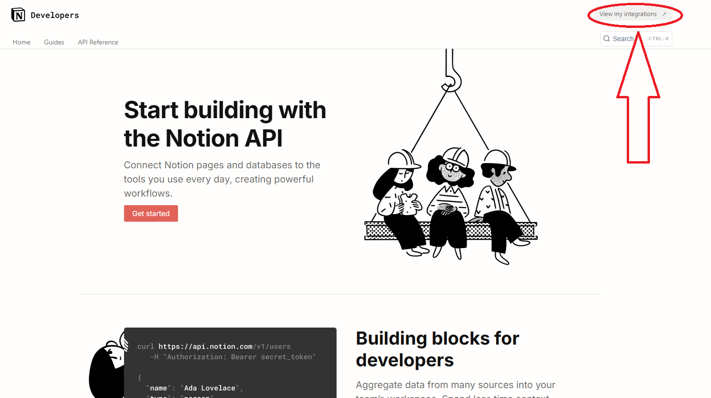

# Tutoriel : Récupérer votre Integration Token et Database ID pour l'API Notion

Suivez ce guide étape par étape :

---

## 1. Créer une intégration interne (Internal Integration)

1. Ouvrez  [https://developers.notion.com/](https://developers.notion.com/) dans votre navigateur.
2. Allez dans View intégration 
    
    
    
3. Cliquez sur nouvelle intégration
    
    
    
4. Donnez lui un nom et associer le a votre workspace 
    
    
    

---

## 2. Récupérer le jeton secret (Integration Token)

1. Dans votre nouvelle intégration, sélectionnez **« Show »** ou **« Afficher »** le token secret.
    
    
    
    
    
2. **Copiez ce token dans l’installeur dans le champs Notion Token**

---

## 3. Partager votre base de données avec l’intégration

1. Toujours sur la même page allez dans accès 
    
    
    
2. Cliquez sur Accès en écriture.
    
    
    
3. Sélectionnez vos pages
    
    
    
4. Appuyez sur mettre a jour
    
    
    

---

## 4. Obtenir l’ID de votre base de données (Database ID)

1. Affichez la base de données en **mode page complète** dans votre navigateur.
    
    
    
    
    
2. Copiez l’URL complète depuis la barre d’adresse.
3. L’**ID** correspond à la **chaîne de 32 caractères alphanumériques** située entre le dernier slash (`/`) et avant le `?` ou la fin de l’URL.
    
    Par exemple :
    
    https://www.notion.so/MonWorkspace/ **1234567890abcdef1234567890abcdef**?v=987
                                                                              
    => **1234567890abcdef1234567890abcdef**

    
    
4. Ajoutez cette ID dans le champs base Notion de l’installer